# Cross-Sensor Optical Ship Detection with Mixed Fine-Tuning

Domain-adaptive YOLO26-S ship detection from **LEVIR-Ship (GF-1/GF-6)** to **Sentinel-2**, with source-domain retention analysis and direct inference on unseen Sentinel-2 imagery.

## Overview

This project investigates whether a ship detector trained on one optical satellite domain can be adapted to **Sentinel-2** while minimizing loss of its original detection capability.

A YOLO26-S detector was first trained on **LEVIR-Ship**, constructed from **GaoFen-1 (GF-1) and GaoFen-6 (GF-6)** optical imagery. The source model achieved strong performance on the independent LEVIR test set. Mixed fine-tuning was then performed using LEVIR and Sentinel-2 ship imagery at controlled sampling ratios.

The goal is to balance two competing objectives:

1. **Target-domain adaptation** — expose the detector to Sentinel-2 imagery.
2. **Source-domain retention** — minimize degradation of the original LEVIR detection capability.

Among the tested conditions summarized here, **LEVIR : Sentinel-2 = 4 : 1** provided the strongest overall retention/adaptation trade-off.

## Highlights

- YOLO26-S optical satellite ship detection
- Cross-sensor adaptation: **GF-1/GF-6 → Sentinel-2**
- Mixed fine-tuning with source-domain replay
- Multiple source : target sampling-ratio experiments
- Independent LEVIR test evaluation
- Source-domain retention analysis
- Direct inference on **four unseen Sentinel-2 scenes**
- Three-way visual comparison: **LEVIR-only vs. S2SD fine-tuned vs. LEVIR+S2SD mixed fine-tuned**
- Small/tiny-ship detection under medium-resolution satellite imagery

## Motivation

Public Sentinel-2 datasets specifically designed for **ship object detection with bounding-box annotations** are relatively limited. LEVIR-Ship provides a larger source dataset for learning ship-detection representations, while Sentinel-2 is the target sensor domain.

Rather than training only a target-specific detector, this project studies a deployment-oriented question:

> **How can an existing detector be extended to a new satellite sensor while retaining as much previously learned detection capability as possible?**

This makes the project an **adaptation–retention trade-off** problem rather than a simple benchmark-maximization task.

## Workflow

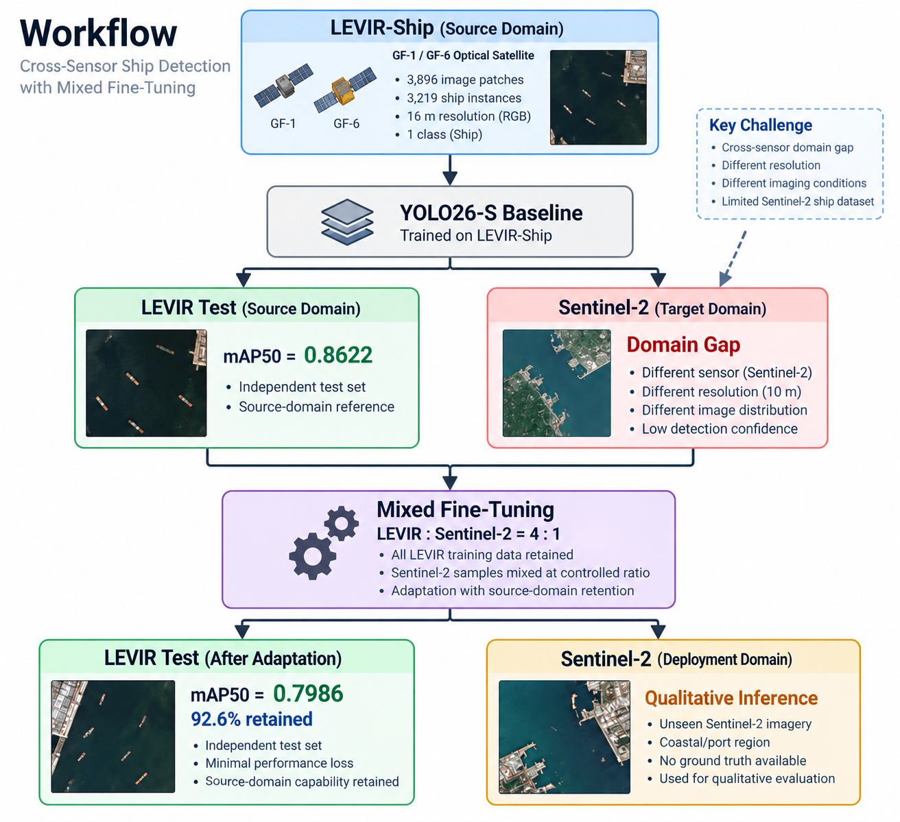

## Cross-Sensor Setting

| Property | Source Domain | Target Domain |
|---|---|---|
| Dataset / imagery | LEVIR-Ship | Sentinel-2 ship imagery |
| Satellite | GF-1 / GF-6 | Sentinel-2 |
| Sensor type | Multispectral optical | Multispectral optical |
| Channels used | RGB | RGB (B4/B3/B2) |
| Spatial resolution | ~16 m | 10 m for RGB |
| Target | Tiny / small ships | Small ships |
| Role | Source-domain learning | Target-domain adaptation |

Although both domains are multispectral optical satellite imagery, their image distributions differ because they come from different sensors, resolutions, acquisition conditions, preprocessing pipelines, backgrounds, and target appearances.

## Datasets

### 1. LEVIR-Ship

LEVIR-Ship is the primary **source-domain** dataset.

```text
Original scenes : 85
Image patches   : 3,896
Ship instances  : 3,219
Patch size      : 512 × 512
Resolution      : ~16 m
Classes         : 1 (Ship)
```

The independent LEVIR test set is retained to quantify how much source-domain capability remains after Sentinel-2 adaptation.

**Dataset source:** [Official LEVIR-Ship GitHub repository](https://github.com/WindVChen/LEVIR-Ship)

**Reference:** J. Chen, K. Chen, H. Chen, Z. Zou, and Z. Shi, “A Degraded Reconstruction Enhancement-based Method for Tiny Ship Detection in Remote Sensing Images with A New Large-scale Dataset,” *IEEE Transactions on Geoscience and Remote Sensing*, vol. 60, 2022, doi: 10.1109/TGRS.2022.3180894.

### 2. Sentinel-2 Ship Detection Dataset

Sentinel-2 ship imagery is used as the **target-domain adaptation dataset**.

RGB bands:

```text
Red   : B4
Green : B3
Blue  : B2
Resolution: 10 m / pixel
```

The target data are mixed with LEVIR training samples during fine-tuning rather than completely replacing the source data.

In this repository, this target dataset is referred to as **S2SD (Sentinel-2 Ship Detection)**.

**Dataset source:** [Sentinel-2 Ship Detection — Roboflow Universe](https://universe.roboflow.com/sentinel2/sentinel-2-ship_detection)

The public dataset is provided for object detection and is available in YOLO-compatible formats. Users should follow the dataset's original license and terms of use.

### 3. Unseen Sentinel-2 Evaluation Scenes

The trained models are additionally applied to **four different Sentinel-2 scenes** that are not used as benchmark training images.

These four scenes are used consistently across all three model configurations:

1. **LEVIR-only** — source-domain baseline without S2SD adaptation
2. **S2SD fine-tuned** — sequential fine-tuning of the LEVIR model on S2SD
3. **LEVIR + S2SD mixed fine-tuned** — mixed-domain adaptation with source replay

Using the same four Sentinel-2 scenes for all models makes the qualitative comparison easier to interpret.

Because independent ship bounding-box ground truth is not available for these deployment scenes, the results are treated as **qualitative cross-sensor evidence**, not quantitative detection accuracy.

**Sentinel-2 imagery source:** [Copernicus Data Space Ecosystem](https://dataspace.copernicus.eu/)

## Sentinel-2 RGB Preprocessing

Sentinel-2 reflectance bands are converted to 8-bit RGB before YOLO inference.

```python
def reflectance_to_uint8(x, vmin=0.02, vmax=0.25):
    x = x.astype(np.float32)
    x = (x - vmin) / (vmax - vmin)
    x = np.clip(x, 0, 1)
    x = np.power(x, 1 / 1.4)
    return (x * 255).astype(np.uint8)

rgb = np.stack([
    reflectance_to_uint8(red),
    reflectance_to_uint8(green),
    reflectance_to_uint8(blue)
], axis=-1)
```

## Baseline: LEVIR-Only Training

The YOLO26-S source model was evaluated on the independent LEVIR test set.

| Metric | LEVIR-Only |
|---|---:|
| Precision | **0.8703** |
| Recall | **0.8678** |
| mAP@0.5 | **0.8622** |
| mAP@0.5:0.95 | **0.3172** |

These values define the source-domain reference before adaptation.

## S2SD-Only Fine-Tuning

To examine target-oriented adaptation separately from source-domain replay, the LEVIR-trained detector is also fine-tuned on **S2SD only**.

This creates an intermediate comparison model:

```text
LEVIR-trained detector
        ↓
S2SD-only fine-tuning
        ↓
Target-oriented Sentinel-2 detector
```

The purpose of this model is to visualize what happens when the detector is adapted toward Sentinel-2 without simultaneously replaying LEVIR samples.

Its predictions on the same four unseen Sentinel-2 scenes are compared with both the original LEVIR-only detector and the final mixed fine-tuned detector.

## Mixed Fine-Tuning Strategy

Instead of fine-tuning exclusively on Sentinel-2, source and target samples are mixed:

```text
LEVIR knowledge
      +
Sentinel-2 exposure
      ↓
Cross-sensor adaptation
      ↓
Reduced source-domain forgetting
```

Multiple LEVIR : Sentinel-2 ratios were tested. Each ratio should be initialized from the **same LEVIR-only checkpoint** for a fair comparison.

The purpose of source replay is not merely to maximize LEVIR performance, but to reduce source-domain degradation while the detector is exposed to the new Sentinel-2 domain.

## Mixed Fine-Tuning Results

Mixed models were fine-tuned for **30 epochs**.

### Independent LEVIR Test

| Training Strategy | Precision | Recall | mAP@0.5 | mAP@0.5:0.95 |
|---|---:|---:|---:|---:|
| **LEVIR-only baseline** | **0.8703** | **0.8678** | **0.8622** | **0.3172** |
| Mixed FT 2:1 | 0.7578 | 0.6938 | 0.7730 | 0.2908 |
| **Mixed FT 4:1 (best.pt)** | **0.7958** | **0.7717** | **0.7986** | **0.2749** |
| Mixed FT 5:1 (best.pt) | 0.7817 | 0.7319 | 0.7650 | 0.2575 |
| Mixed FT 5:1 (last.pt) | 0.7750 | 0.7717 | 0.7829 | 0.2685 |

Additional ratios can be added when their final independent test results are available.

## Why 4:1?

Compared with the LEVIR-only baseline, the 4:1 model changes as follows:

```text
Precision    : 0.8703 → 0.7958   (-0.0745)
Recall       : 0.8678 → 0.7717   (-0.0961)
mAP@0.5      : 0.8622 → 0.7986   (-0.0636)
mAP@0.5:0.95 : 0.3172 → 0.2749   (-0.0423)
```

Relative source-domain mAP@0.5 retention:

```text
0.7986 / 0.8622 ≈ 92.6%
```

Thus, the 4:1 model retains approximately **92.6% of the original LEVIR mAP@0.5** after incorporating Sentinel-2 training data.

Increasing the source ratio further did not monotonically improve retention:

```text
4:1 best mAP@0.5 = 0.7986
5:1 best mAP@0.5 = 0.7650
```

This suggests that simply increasing source-domain sampling does not guarantee a better adapted model.

## Source-Domain Retention

The adaptation result should **not** be described as preserving LEVIR performance without loss. There is measurable degradation.

A more precise interpretation is:

> **The detector was adapted toward Sentinel-2 while retaining 92.6% of the original LEVIR mAP@0.5 under the selected 4:1 mixed fine-tuning condition.**

This explicitly treats adaptation as a trade-off between new-domain exposure and previously learned source-domain capability.

## Small-Object Localization

LEVIR-Ship and Sentinel-2 ship detection both involve small/tiny targets. For a small bounding box, a displacement of only a few pixels can cause a large IoU change.

This is a plausible contributor to the gap between:

```text
mAP@0.5      = 0.7986
mAP@0.5:0.95 = 0.2749
```

However, this should be treated as a hypothesis until AP75, false-positive cases, and prediction/ground-truth box alignment are analyzed.

## Sentinel-2 Qualitative Comparison

To visualize the effect of cross-sensor adaptation, **three model configurations are applied to the same four Sentinel-2 scenes**.

This produces a total of **12 inference images**:

```text
                         Sentinel-2 Scene
                    1        2        3        4
                 ─────────────────────────────────
LEVIR-only          ✓        ✓        ✓        ✓
S2SD fine-tuned     ✓        ✓        ✓        ✓
Mixed fine-tuned    ✓        ✓        ✓        ✓
```

For a fair comparison, all three models should use the same RGB preprocessing, inference image size, confidence threshold, NMS threshold, and visualization settings.

### 1. LEVIR-Only Model

The first row shows direct transfer from the GF-1/GF-6-based source detector to Sentinel-2 without target-domain fine-tuning.

| Scene 1 | Scene 2 |
|---|---|
| 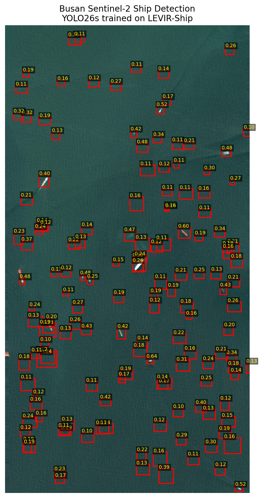 | 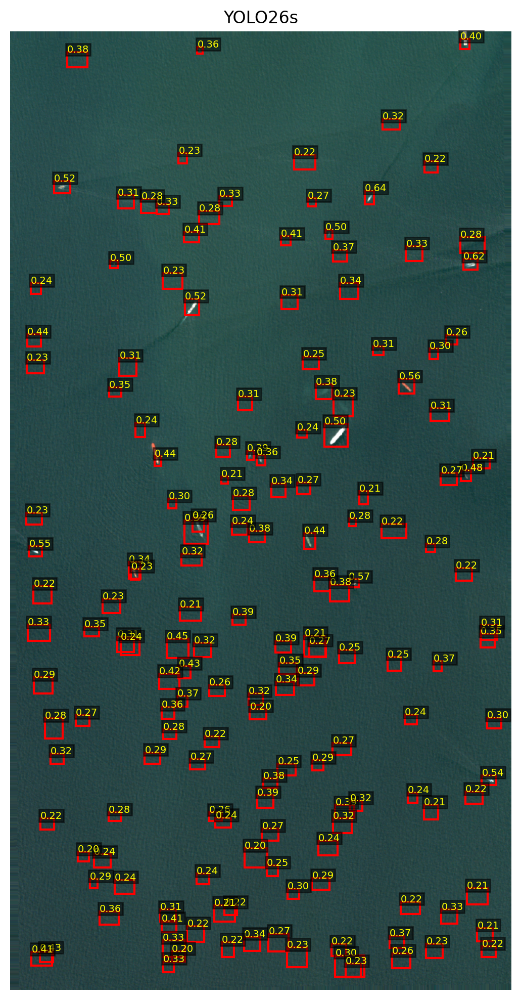 |
| **Scene 3** | **Scene 4** |
| 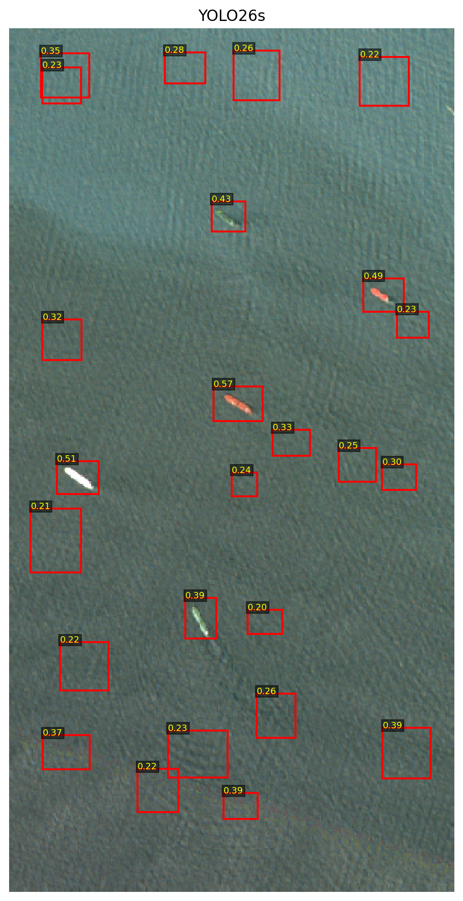 | 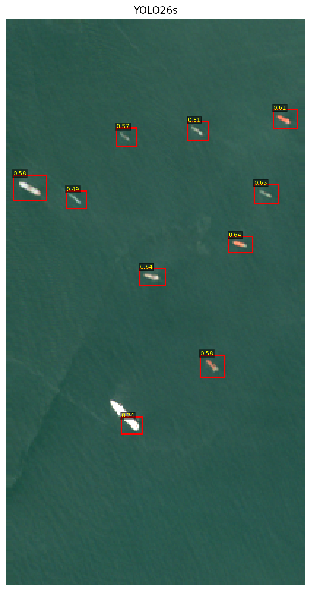 |

### 2. S2SD Fine-Tuned Model

The second row shows the LEVIR-trained model after target-oriented fine-tuning on S2SD.

| Scene 1 | Scene 2 |
|---|---|
| 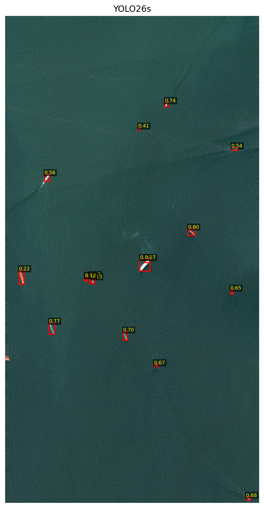 | 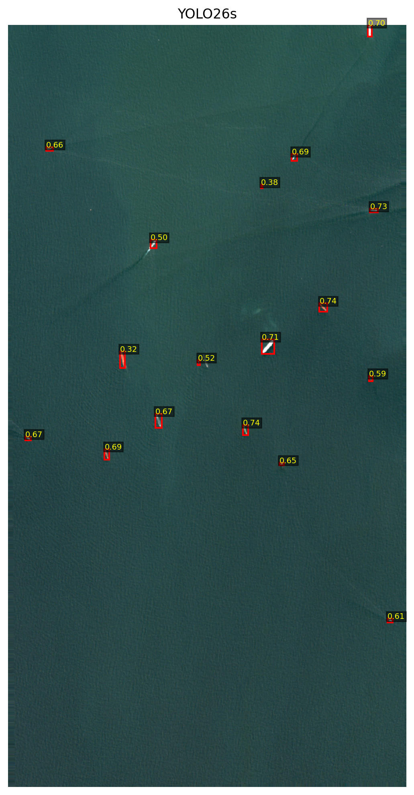 |
| **Scene 3** | **Scene 4** |
| 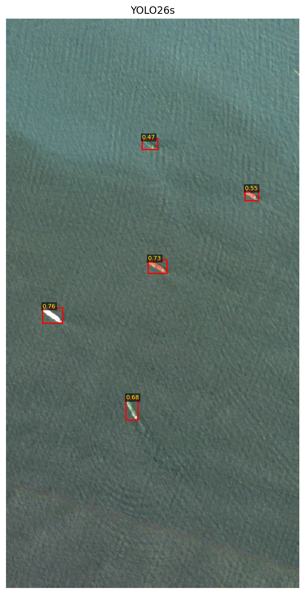 | 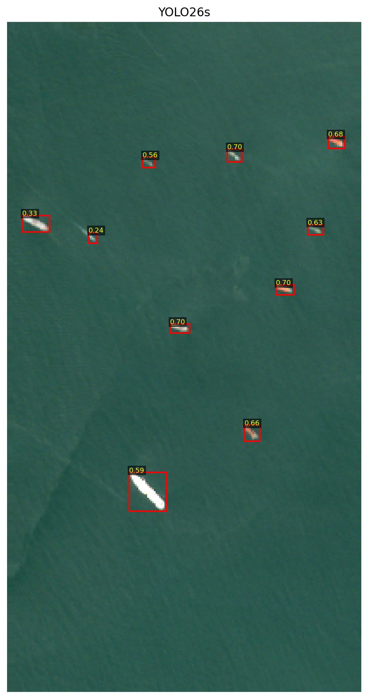 |

### 3. LEVIR + S2SD Mixed Fine-Tuned Model

The third row shows the final mixed-domain model. The selected configuration uses **LEVIR : S2SD = 4 : 1**.

| Scene 1 | Scene 2 |
|---|---|
| 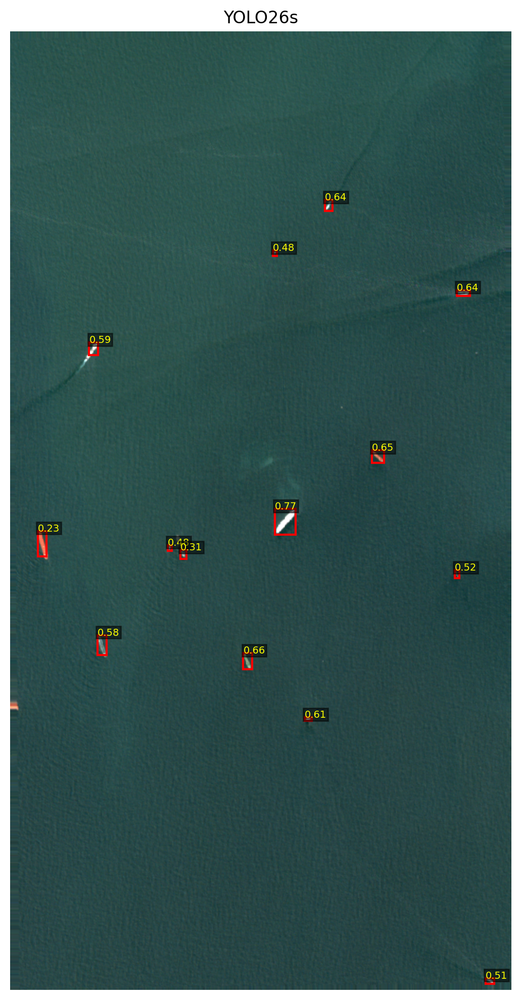 | 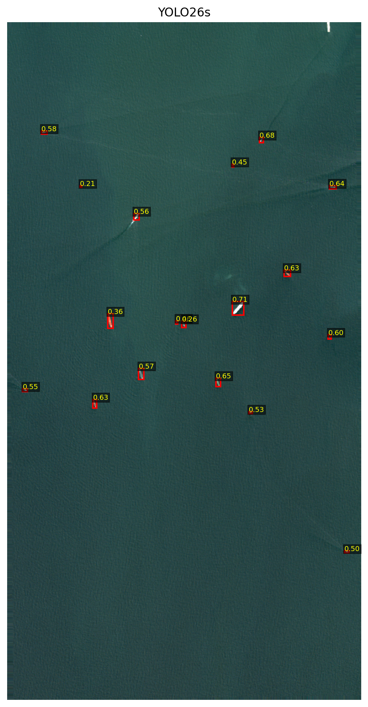 |
| **Scene 3** | **Scene 4** |
| 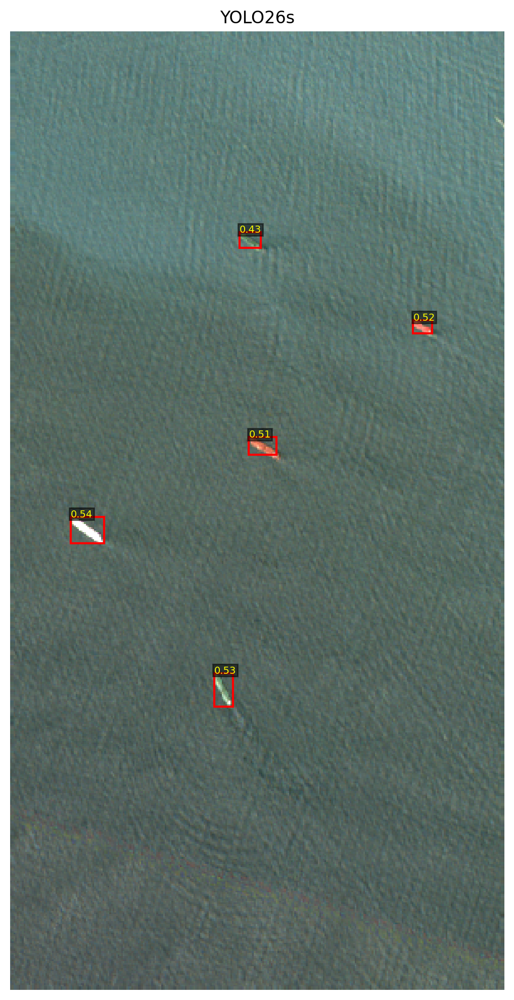 |  |

### Visual Comparison Objective

The three-stage comparison is intended to show:

```text
LEVIR-only
    ↓
Cross-sensor domain gap on Sentinel-2

S2SD fine-tuning
    ↓
Target-oriented adaptation

LEVIR + S2SD mixed fine-tuning
    ↓
Target-domain exposure + source-domain retention
```

Changes in detection confidence, missed ship-like targets, duplicate detections, and false-positive behavior can be inspected consistently across the same four scenes.

Because these scenes do not have independent verified bounding-box ground truth in this experiment, the visual results are interpreted as **qualitative evidence of model response**, not quantitative improvements in precision, recall, or mAP.

## Experimental Interpretation

```text
Strong source detector
        ↓
New satellite sensor
        ↓
Domain gap
        ↓
Target adaptation
        ↓
Source-domain degradation
        ↓
Mixed-domain replay
        ↓
Adaptation–retention trade-off
```

The main engineering question is:

> **How much source-domain performance is lost during adaptation to a new sensor, and how can that loss be minimized?**

## Key Findings

1. **The LEVIR-only detector provides a strong source baseline.**  
   P = 0.8703, R = 0.8678, mAP@0.5 = 0.8622.

2. **Cross-sensor adaptation causes measurable source-domain degradation.**

3. **Mixed fine-tuning provides a mechanism for controlling the adaptation–retention trade-off.**

4. **The reported 4:1 condition provides the strongest overall source-retention result among the summarized mixed experiments.**  
   LEVIR mAP@0.5 = 0.7986 after adaptation.

5. **Approximately 92.6% of the original LEVIR mAP@0.5 is retained.**

6. **More source data does not automatically improve retention.**  
   The 5:1 experiment performed worse than 4:1 on the independent LEVIR test.

7. **Strict localization remains challenging for small ships.**  
   Further AP75 and error analysis is needed.

## Important Evaluation Note

LEVIR test results are **quantitative** because ground-truth bounding boxes are available.

The four Sentinel-2 deployment results are currently **qualitative** because independent verified ship bounding boxes are not available for those scenes.

Therefore:

- LEVIR Precision / Recall / mAP are quantitative metrics.
- Sentinel-2 boxes and confidence scores across the four scenes are model outputs.
- Higher target-domain confidence alone does not prove higher accuracy.
- The **92.6%** figure refers specifically to **LEVIR source-domain mAP@0.5 retention**.
- Rigorous target-domain accuracy requires an independent annotated Sentinel-2 validation/test set.

## Repository Structure

```text
Optical_Ship_Detection_Domain_Adaptation/
│
├── notebooks/
│   ├── mapping_sentinel2.m
│   ├── Train_YOLO.ipynb
│   ├── Fine_Tuning.ipynb
│   ├── Mixed_Finetuning.ipynb
│   ├── Test_LEVIR_Dataset.ipynb
│   └── Visualization_Result.ipynb
│
├── figures/
│   ├── Workflow.png
│   ├── LEVIR_only_S2_scene1.png
│   ├── LEVIR_only_S2_scene2.png
│   ├── LEVIR_only_S2_scene3.png
│   ├── LEVIR_only_S2_scene4.png
│   ├── S2SD_FT_S2_scene1.png
│   ├── S2SD_FT_S2_scene2.png
│   ├── S2SD_FT_S2_scene3.png
│   ├── S2SD_FT_S2_scene4.png
│   ├── Mixed_4to1_S2_scene1.png
│   ├── Mixed_4to1_S2_scene2.png
│   ├── Mixed_4to1_S2_scene3.png
│   ├── Mixed_4to1_S2_scene4.png
│   └── Ratio_Performance_Comparison.png
│
├── README.md
├── requirements.txt
├── .gitignore
└── LICENSE
```

Adjust notebook and figure names to match the repository.

## Requirements

Experiments were developed primarily in Google Colab.

```text
Python
PyTorch
TorchVision
Ultralytics
OpenCV
NumPy
Matplotlib
PyYAML
h5py
```

Example installation:

```bash
pip install ultralytics opencv-python numpy matplotlib pyyaml h5py
```

## Data Availability

Large satellite datasets and imagery are not included directly in this repository. Users should obtain datasets from their original providers and follow the corresponding licenses and terms of use.

- **LEVIR-Ship** — source-domain dataset; official repository: https://github.com/WindVChen/LEVIR-Ship
- **S2SD (Sentinel-2 Ship Detection)** — target-domain adaptation dataset: https://universe.roboflow.com/sentinel2/sentinel-2-ship_detection
- **Sentinel-2 deployment imagery** — four qualitative evaluation scenes obtained from Copernicus Sentinel-2 data

Large trained checkpoints may need to be stored separately.

## Dataset Sources and References

### LEVIR-Ship

- Official repository: https://github.com/WindVChen/LEVIR-Ship
- Source satellites: GaoFen-1 and GaoFen-6
- RGB multispectral imagery, 16 m spatial resolution
- Reference: Chen, J., Chen, K., Chen, H., Zou, Z., & Shi, Z. (2022). *A Degraded Reconstruction Enhancement-based Method for Tiny Ship Detection in Remote Sensing Images with A New Large-scale Dataset*. IEEE Transactions on Geoscience and Remote Sensing, 60, 1–14. https://doi.org/10.1109/TGRS.2022.3180894

### S2SD — Sentinel-2 Ship Detection

- Dataset page: https://universe.roboflow.com/sentinel2/sentinel-2-ship_detection
- Platform: Roboflow Universe
- Task: ship object detection in Sentinel-2 imagery
- Dataset license listed by the provider: BY-NC-SA 4.0

### Sentinel-2 Deployment Imagery

- Copernicus Data Space Ecosystem: https://dataspace.copernicus.eu/
- Sensor: Sentinel-2 MSI
- RGB bands used in this project: B4 / B3 / B2

## Limitations

### 1. Limited Quantitative Target-Domain Evaluation

The four deployment scenes do not currently have independent verified ship bounding-box annotations. Target-domain deployment results are therefore interpreted qualitatively.

### 2. Source-Domain Performance Loss

The 4:1 model retains approximately 92.6% of baseline LEVIR mAP@0.5, but the original source-domain performance is not completely preserved.

### 3. Small-Object Localization

mAP@0.5:0.95 remains substantially below mAP@0.5. Further analysis is required to separate tiny-object localization difficulty from annotation uncertainty and other detector errors.

### 4. Ratio Selection

The 4:1 ratio is the strongest reported condition among the experiments summarized here. It should not be interpreted as universally optimal.

### 5. Cross-Sensor Generalization

More Sentinel-2 regions, dates, sea states, coastal environments, and independently annotated scenes are required for a comprehensive generalization study.

## Future Work

- Quantitative evaluation on an independent Sentinel-2 test set
- Manual annotation or AIS-assisted validation of the four Sentinel-2 evaluation scenes
- False-positive and false-negative analysis
- AP50 / AP75 comparison
- Hard-negative mining for ports and coastal structures
- Multi-scale training for small ships
- Feature-level domain alignment
- Domain-adversarial adaptation
- Evaluation on additional Sentinel-2 regions and acquisition dates

## Conclusion

This project demonstrates a practical **cross-sensor domain adaptation problem in optical satellite ship detection**.

The LEVIR-only YOLO26-S baseline achieved:

```text
Precision    : 0.8703
Recall       : 0.8678
mAP@0.5      : 0.8622
mAP@0.5:0.95 : 0.3172
```

After mixed fine-tuning with Sentinel-2 data using a **4:1 LEVIR-to-Sentinel-2 ratio**:

```text
Precision    : 0.7958
Recall       : 0.7717
mAP@0.5      : 0.7986
mAP@0.5:0.95 : 0.2749
```

The adapted detector therefore retains approximately **92.6% of the original LEVIR mAP@0.5** while being exposed to the Sentinel-2 target domain.

The main result is not adaptation without cost, but that **mixed-domain fine-tuning provides a practical way to control the trade-off between adaptation to a new optical satellite sensor and retention of previously learned source-domain detection capability**.

## Author

Jinho Lee  
Satellite Oceanography Laboratory  
Seoul National University
